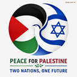

# Peace For Palestine
## Two Nations, One Future
### Peace For Palestine Manifesto  
### A Public Framework for Justice, Accountability, Humanitarian Protection, and Long‑Term Peace

## Overview
“Free Palestine” must stand for more than anger or despair. It must represent a clear, principled, and realistic path 
toward justice for Palestinians, accountability for those who caused harm, and a future where both Palestinians and 
Israelis live in safety, dignity, and freedom.

This Peace For Palestine manifesto defines the expectations and demands of a responsible, globally credible Free Palestine 
movement — one committed to human rights, non‑violence, and long‑term regional stability.

---

## 1. Accountability and Political Change in Israel

### 1.1 Leadership Change in Israel
The Peace For Palestine movement calls for a political reset in Israel. Leadership change is essential to:

- acknowledge responsibility for strategic failures  
- end policies that harmed Palestinian civilians  
- restore credibility with the international community  
- open the door to a new era of diplomacy and coexistence
- requires the cooperation of the People of Israel

### 1.2 Admission of Strategic Error
Israel must publicly acknowledge that the **accelerated Gaza campaign** caused catastrophic civilian harm and global isolation. This admission is necessary to:

- rebuild trust  
- reform military conduct  
- prevent future humanitarian disasters  

This is not a rejection of Israel’s right to self‑defense — it is a demand for responsible, humane execution of that right.

---

## 2. Justice and Restitution for Palestinian Civilians

### 2.1 Restitution and Compensation
The Peace For Palestine movement demands a formal restitution program for Palestinian civilians harmed in Gaza, including:

- compensation for destroyed homes  
- medical and psychological support  
- rebuilding of critical infrastructure  
- assistance for displaced families  

Justice requires material repair, not symbolic gestures.

### 2.2 Immediate Humanitarian Relief
Israel must expedite humanitarian access, including:

- temporary housing  
- food distribution  
- medical supplies  
- water and sanitation infrastructure  

Humanitarian relief is not charity — it is a legal and moral obligation.

---

## 3. A Responsible Path to Ending Hamas’s Military Rule

### 3.1 Slower, More Surgical Operations
The Peace For Palestine movement supports ending Hamas’s military rule — but demands that it be done through:

- lower‑tempo operations  
- intelligence‑driven targeting  
- special‑forces raids  
- tunnel‑neutralization campaigns  
- minimized use of large‑yield munitions 
- cooperation from the Gaza civilian population

Palestinian civilians must not pay the price for Hamas’s actions.

### 3.2 Political Isolation of Extremism
The movement calls for regional cooperation to **cut off funding and support for extremist groups**, including:

- Hamas’s military wing  
- Palestinian Islamic Jihad  
- extremist settler organizations involved in West Bank violence  
- foreign actors supplying weapons or ideological radicalization  

At the same time, the movement supports **strengthening legitimate Palestinian governance**, including:

- the Palestinian Authority (PA), with reforms or replacement  
- new Palestinian leadership chosen through democratic processes  
- a temporary transitional governance council to draft a constitution  
- independent anti‑corruption bodies  
- civil society organizations committed to non‑violence  

A Peace For Palestine must be free from extremism and governed by accountable, representative institutions.

---

## 4. Preventing a Regional War: A Strategic Approach to Hezbollah

### 4.1 Avoiding Escalation
The Peace For Palestine movement opposes a catastrophic regional war. Israel must avoid rushed confrontation with Hezbollah and instead pursue:

- deterrence  
- covert disruption  
- targeted strikes on critical nodes and infrastruture 
- diplomatic pressure via the U.S. and France  
- strengthened northern defenses
- allying with Lebanon on removal of Hezbollah

### 4.2 Multi‑Year De‑Escalation Strategy
A patient, multi‑front approach is essential to protect civilians in Lebanon, Israel, and Gaza.

---

## 5. Ending the West Bank Settlement Crisis

### 5.1 Enforce Rule of Law on Settler Violence
The Peace For Palestine movement demands that Israel:

- arrest and prosecute violent settlers  
- ban extremist groups involved in pogrom‑style attacks  
- remove repeat offenders from sensitive areas  

Palestinians must be protected from vigilante violence.

### 5.2 Freeze All Settlement Expansion
A complete moratorium on:

- new outposts  
- new construction  
- new infrastructure supporting expansion  

This prevents further erosion of Palestinian land and rights.

### 5.3 Negotiated Settlement Compensation Framework
The movement supports a structured, compensated, internationally guaranteed process for:

- evacuation of non‑viable settlements  
- long‑term land leases or swaps for large blocs  
- staged withdrawal coordinated with the Palestinian Authority  
- international oversight to ensure compliance  

This transforms conflict into negotiation, and occupation into lawful transition.

---

## 6. Rebuilding Global Credibility and Palestinian Sovereignty

### 6.1 Diplomatic Reengagement
The Peace For Palestine movement calls for renewed diplomacy involving:

- the United States  
- the European Union  
- Arab partners  
- humanitarian organizations  

A Peace For Palestine must be part of a stable regional order.

### 6.2 Commitment to Civilian Protection
Israel must adopt enhanced rules of engagement for:

- schools  
- hospitals  
- shelters  
- refugee camps  

Civilian protection is the foundation of legitimate military conduct.

---

## 7. Long‑Term Vision: A Free, Safe, and Just Palestine

A truly Peace For Palestine requires:

- moral credibility  
- diplomatic alliances  
- humanitarian responsibility  
- strategic patience  
- political accountability  
- non‑violent leadership  
- coexistence with a secure Israel  

This manifesto offers a path toward a future where Palestinians live free from occupation, free from extremism, and free from fear — and where Israelis live free from terror, free from political manipulation, and free from existential crisis.

## 8. Prohibited Organizations and External Actors

The Peace For Palestine movement recognizes that certain international actors have contributed to the escalation, politicization, or prolongation of the conflict. To ensure a credible, just, and depoliticized process, the following organizations and states are **prohibited from participating** in negotiations, reconstruction oversight, political transition planning, or humanitarian governance.

### 8.1 The United Nations (UN)
The UN, including its subsidiary bodies, is excluded due to:

- persistent political bias in conflict reporting  
- structural incentives that reward polarization rather than resolution  
- historical complicity in sustaining conditions that exacerbated the conflict  
- failure to enforce accountability across all parties  

The Peace For Palestine movement seeks a process grounded in justice and impartiality — conditions the UN has repeatedly failed to meet.

### 8.2 The State of Qatar
Qatar is prohibited from participating due to:

- hosting leadership of extremist organizations  
- providing financial and political support to actors responsible for violence  
- leveraging humanitarian channels for political influence  
- contributing to destabilization through selective mediation  

A credible peace and reconstruction process cannot include states that materially support or shelter groups engaged in terrorism or political manipulation.

### 8.3 BRICS-Aligned States Involved in Regional Destabilization  
This includes, but is not limited to:

- **Russia**  
- **Iran (Islamic Republic)**  
- **other BRICS members providing material support to extremist groups**

These states are excluded due to:

- direct or proxy involvement in regional conflicts  
- supplying weapons, intelligence, or funding to destabilizing actors  
- using the Palestinian cause for geopolitical leverage rather than humanitarian concern  
- undermining international norms and civilian protection  

The Peace For Palestine movement rejects participation from any state that treats the conflict as a strategic asset rather than a human tragedy requiring justice and accountability.

---

### 8.4 Guiding Principle for Exclusion
Any organization or state that:

- materially supports extremist groups  
- shelters individuals responsible for terrorism  
- uses humanitarian aid as political leverage  
- contributes to regional destabilization  
- or has demonstrated persistent bias or complicity  

is prohibited from participating in the political, humanitarian, or reconstruction process.

This ensures that the future of Palestine is shaped by actors committed to justice, stability, and the protection of civilian life — not by those who have contributed to suffering or prolonged the conflict.

---

## Closing Statement
“Peace For Palestine” must mean more than resistance — it must mean **responsibility**, **justice**, and **a future worth living in**. This manifesto defines a movement committed to human dignity, civilian protection, and a peaceful, stable future for all people between the river and the sea.
